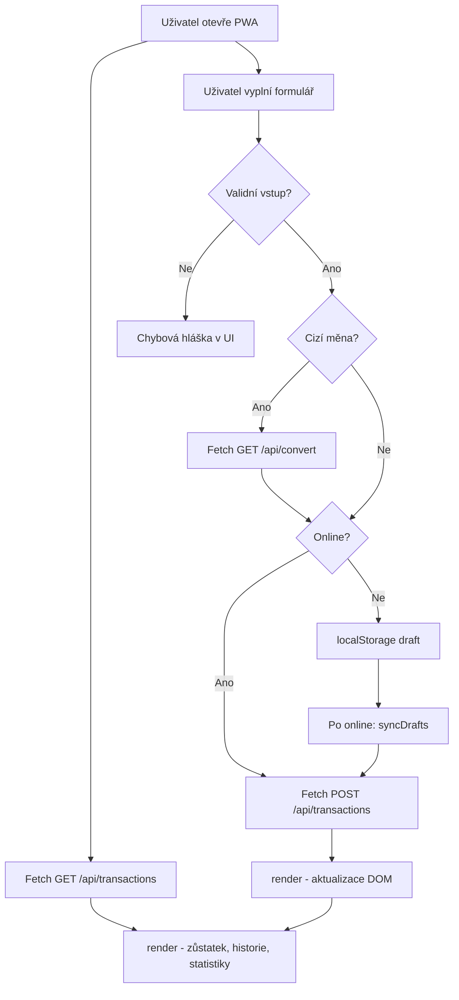

# Dokumentace – Finanční aplikace

Webová PWA pro sledování osobních příjmů a výdajů. Projekt je **webová aplikace v JavaScriptu** (HTML, CSS, JS) ve složce `web/`.

**Související soubory:**

- [navrh-projektu.md](./navrh-projektu.md) – schválené zadání projektu
- [README.md](./README.md) – rychlý přehled a spuštění

---

## 1. Účel aplikace

Aplikace slouží k rychlému zapisování transakcí (např. po nákupu v obchodě), zobrazení aktuálního zůstatku, historie a statistik podle kategorií. Nastavení a offline drafty se ukládají v prohlížeči (`localStorage`); transakce se synchronizují s REST API.

Podporované měny zobrazení: **CZK, EUR, USD, GBP, PLN, CHF, HUF, SEK**. Pro srovnání statistik se pracuje s **kladnou částkou v Kč** a polem `type` (příjem / výdaj).

---

## 2. Struktura projektu

### Repozitář

```
financni-appka/
├── web/                  # Webová aplikace (hlavní projekt)
├── navrh-projektu.md     # Zadání projektu
├── DOKUMENTACE.md        # Tato dokumentace
└── README.md             # Přehled a spuštění
```

### Složka `web/`

```
web/
├── index.html            # Struktura UI (záložky, formuláře, modály)
├── style.css             # Styly, dark mode, responzivita
├── script.js             # Hlavní logika aplikace
├── api.js                # REST klient (Fetch API)
├── sw.js                 # Service Worker
├── manifest.json         # PWA manifest
├── config.example.js     # Vzor konfigurace API klíče
├── config.js             # API klíč (lokálně, není v gitu)
├── favicon.svg
├── apple-touch-icon.png
├── icon-192.png
└── icon-512.png
```

| Soubor | Úloha |
|--------|-------|
| `index.html` | Sémantická kostra – formuláře, záložky, canvas pro graf |
| `style.css` | Vzhled, tmavý režim, responzivní layout |
| `script.js` | Validace, render DOM, offline logika, graf, PWA registrace |
| `api.js` | Veškerá komunikace s REST API |
| `sw.js` | Cache statických souborů pro offline UI |
| `manifest.json` | Metadata pro instalaci PWA |
| `config.example.js` | Vzor souboru s `FINANCE_API_KEY` |

---

## 3. Spuštění aplikace

1. Nainstalovat závislosti: `npm install`
2. Vytvořit `web/config.js` podle `web/config.example.js` a nastavit `FINANCE_API_KEY`
3. Spustit: `npm start` → otevřít **http://localhost:3000**
4. V produkci aplikace běží na školním / nasazeném hostingu

Aplikace se otevírá v prohlížeči; z menu prohlížeče lze PWA nainstalovat na plochu.

---

## 4. Princip fungování – JavaScript

### 4.1 Načtení stránky

1. **`init()`** – naváže event listenery, načte nastavení z `localStorage`, zaregistruje service worker.
2. **`bootstrap()`** – načte transakce (`fetchTransactions`), kurzy (`fetchRatesFromCzk`), synchronizuje offline drafty (`syncDrafts`).
3. **`render()`** – přepočítá a vykreslí zůstatek, přehled, seznam; volitelně graf statistik.

### 4.2 Přidání transakce

1. Uživatel odešle formulář → **`handleFormSubmit()`**
2. **`parseAmount()`** ověří číslo
3. Pokud je zvolena cizí měna → **`convertToCzk()`** (Fetch `/api/convert`)
4. Online → **`createTransaction()`** (Fetch POST). Offline → **`saveDraft()`** do `localStorage`
5. **`render()`** aktualizuje DOM bez obnovení stránky

### 4.3 Offline režim

- `navigator.onLine` určí, zda jde požadavek na API nebo do draftů
- Po eventu **`online`** funkce **`syncDrafts()`** postupně odešle uložené drafty a překreslí UI

### 4.4 Dynamický obsah

| Akce | Co se mění v DOM |
|------|------------------|
| Načtení dat | Seznam transakcí (`renderList`), zůstatek, karty přehledu |
| Nová transakce | Okamžitá aktualizace bez reloadu |
| Změna měny / tématu | Symboly měn, formát částek, barvy |
| Záložka Statistiky | Canvas graf, filtry období a typu |
| Úprava / smazání | Modální okna, PATCH / DELETE přes Fetch |

**Důležité funkce v `script.js`:**

| Funkce | Účel |
|--------|------|
| `parseAmount()` | Validace částky z inputu |
| `addTransaction()` | Převod na Kč + POST nebo offline draft |
| `toDisplayAmount()` | Přepočet z Kč do zvolené měny zobrazení |
| `renderList()` | Dynamické generování `<li>` z pole `transactions` |
| `renderChart()` | Canvas graf (sloupce / kruh) podle kategorií |
| `toggleTheme()` | Přepnutí světlého/tmavého režimu |
| `syncDrafts()` | Odeslání offline transakcí po obnovení sítě |

### 4.5 `api.js`

Centrální Fetch klient. Exportované funkce:

- `fetchTransactions`, `createTransaction`, `updateTransaction`, `deleteTransaction`
- `fetchRatesFromCzk`, `convertToCzk`

Každý požadavek obsahuje hlavičky `Content-Type: application/json` a `X-API-Key`. Adresa API se nastaví v `resolveApiBase()` podle hostname (lokálně `/api`, v produkci nasazená URL).

---

## 5. localStorage

| Klíč | Obsah |
|------|-------|
| `theme` | `"light"` nebo `"dark"` |
| `displayCurrency` | např. `"EUR"` |
| `activeTab` | `"overview"`, `"add"`, `"stats"`, `"history"` |
| `currencyRates` | JSON `{ rates, source, date, updatedAt }` – cache kurzů |
| `transactionDrafts` | JSON pole transakcí čekajících na sync |

Draft obsahuje pole `name`, `type`, `amount`, `category` – stejně jako tělo POST požadavku.

---

## 6. REST API – endpointy

Aplikace s těmito endpointy komunikuje přes **`api.js`** (Fetch API). Všechny cesty pod `/api` vyžadují hlavičku **`X-API-Key`**.

### Transakce

#### `GET /api/transactions`

Načtení všech transakcí při startu aplikace.

**Odpověď 200:**

```json
[
  {
    "id": "uuid",
    "name": "Oběd",
    "type": "expense",
    "amount": 150,
    "category": "Jídlo",
    "createdAt": "2026-06-07T12:00:00.000Z"
  }
]
```

#### `POST /api/transactions`

Vytvoření transakce z formuláře.

**Tělo:**

```json
{
  "name": "Oběd",
  "type": "expense",
  "amount": 150,
  "category": "Jídlo"
}
```

- `amount` – kladné číslo v **Kč** (frontend převede cizí měnu před odesláním)
- `type` – `"income"` nebo `"expense"`

**Odpověď 201:** vytvořený objekt transakce.

#### `PATCH /api/transactions/:id`

Úprava z modálního formuláře (`name`, `type`, `amount`, `category`).

**Odpověď 200:** upravený objekt. **404** pokud ID neexistuje.

#### `DELETE /api/transactions/:id`

Smazání z potvrzovacího dialogu.

**Odpověď 204** bez těla. **404** pokud ID neexistuje.

### Kurzy a převod

#### `GET /api/rates`

Načtení kurzů pro přepočet zobrazení (volá `fetchAndCacheRates()`).

**Odpověď 200:**

```json
{
  "base": "CZK",
  "date": "2026-06-07",
  "source": "frankfurter",
  "rates": {
    "EUR": 0.0411,
    "USD": 0.0477
  }
}
```

#### `GET /api/convert?amount=15&from=EUR&to=CZK`

Převod zadané částky do Kč před uložením transakce.

**Odpověď 200:**

```json
{
  "amount": 15,
  "from": "EUR",
  "to": "CZK",
  "result": 364.96
}
```

---

## 7. HTML a CSS

### HTML (`index.html`)

- Sémantické elementy: `header`, `nav`, `main`, `section`, `form`
- Záložky s `role="tablist"`, skryté panely přes atribut `hidden`
- Přístupnost: `aria-label`, `aria-live`, `role="alert"` u chyb

### CSS (`style.css`)

- **CSS proměnné** v `:root` pro barvy a stíny
- **Dark mode** přes `[data-theme="dark"]` na `<html>`
- **Responzivita:** mobilní first, `min()`, `safe-area-inset`, touch-friendly tlačítka
- **Komponenty:** karty přehledu, seznam transakcí, statistiky, modály (sheet, dialog)

---

## 8. PWA

### `manifest.json`

- `display: standalone` – aplikace bez lišty prohlížeče
- Ikony 192×512, theme color `#2563eb`
- `start_url: ./`

### `sw.js` (Service Worker)

1. **Install** – uloží do cache statické soubory (`index.html`, CSS, JS, ikony)
2. **Activate** – smaže staré verze cache
3. **Fetch** – u GET nejdřív síť, při offline fallback na cache. Požadavky na `/api/` nejsou zachytávány

Registrace v `script.js`: `navigator.serviceWorker.register('sw.js')`.

---

## 9. Use-case diagram



---

## 10. Tok dat – přidání transakce

**Online:**

```
Formulář (submit)
    → parseAmount()
    → convertToCzk()  [pokud měna ≠ CZK]
    → createTransaction()  [Fetch POST]
    → transactions.unshift(created)
    → render()
```

**Offline:**

```
saveDraft() → localStorage.transactionDrafts
→ syncDrafts() po navigator.onLine
→ createTransaction() → render()
```

---

## 11. Kategorie

**Výdaje:** Jídlo, Doprava, Zábava, Bydlení, Zdraví, Oblečení, Ostatní

**Příjmy:** Mzda, Freelance, Dárek, Prodej, Investice, Ostatní

Typ se volí přepínačem Výdaj / Příjem; podle typu JavaScript dynamicky mění položky v `<select>`.

---

## 12. Konfigurace a bezpečnost

- **`web/config.js`** – obsahuje `window.FINANCE_API_KEY` pro hlavičku `X-API-Key` (soubor je v `.gitignore`)
- Výstup do DOM prochází **`escapeHtml()`** proti XSS při generování seznamu transakcí
- Tajný klíč se do repozitáře necommituje – pouze `config.example.js`

---

## 13. Splnění požadavků zadání

| Požadavek | Splnění |
|-----------|---------|
| JavaScript, dynamický obsah | `script.js` – render, formuláře, graf, záložky |
| localStorage | Téma, drafty, měna, záložka, cache kurzů |
| REST API | `api.js` – Fetch API, CRUD transakcí, kurzy, převod |
| PWA | `manifest.json` + `sw.js` + instalace na plochu |
| HTML / CSS | Sémantické HTML, responzivní CSS, dark mode |
| Use-case | Sekce 9, `navrh-projektu.md` §2 |
| Rozšířitelnost | `navrh-projektu.md` §10 |
